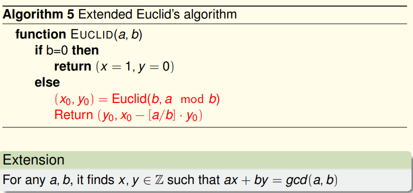
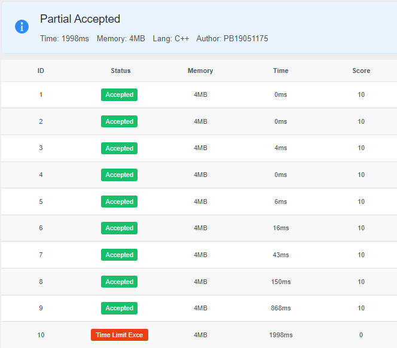

# 算法基础实验五报告

***

梁峻滔 PB19051175

***

## 5-1 最小平均权重环

使用算法导论思考题24-5(Karp的最小平均权重环路算法)的一个结论:
$$
μ^* = \mathop{min}\limits_{v∈V}\ \mathop{max}\limits_{0 \leq k \leq n-1} \frac{F[n][v]-F[k][v]}{n-k}
$$
其中 n 为图中节点数, s是任取的一个节点, $F[k][v]$表示从 s 到 v 的长度为 k 的最短路径的权值和, 如果不存在长度为 k 的路径则值为$∞$, $u^*$即为所求的最小平均权值环的平均权值.

先随意选定一个节点s, 然后初始化$F[0][s] = 0$, 其他 F 值都初始化为$∞$. 利用以下公式
$$
F[k][v] = \mathop{min}\limits_{(u,v)∈E}\{ F[k-1][u] + w[u][v] \}
$$
来计算所有的F值. 计算过程使用了类似 Bellman-Ford 算法中的双重循环. 计算出F值后最后再用一个双重循环, 考察所有k和所有节点v来选出$μ^*$. 时间复杂度为$O(n^2+nm)$, 当 m >> n 时就是$O(nm)$.

## 5-2 最小权最大匹配

可以用匈牙利算法求最大匹配边数. 匈牙利算法思想为:

* 对于s, t两侧, 任意选定一侧, 假设为s侧, 对s中的每个顶点使用DFS
* DFS为从未匹配的顶点出发, 沿着交替路搜索增广路, 如果找到增广路就交换增广路上的匹配边和未匹配边, 从而得到总匹配边数+1

求最小权的最大匹配就是在匈牙利算法的框架上, 在DFS过程中, 在选择当前顶点u的下一个顶点时, 先对其所有邻边按代价排序, 然后从小到大选择下一个DFS的顶点. 这样得到的最大匹配的总权值是最小的.

## 5-3 尾数还原

本题实际上是要求解线性同余方程组
$$
\left\{\begin{align}
N ≡ r_1\ (mod\ p_1) \\
N ≡ r_2\ (mod\ p_2) \\
N ≡ r_3\ (mod\ p_3) \\
...\\
N ≡ r_k\ (mod\ p_k) \\
\end{align}\right.
$$
其中$p_i$均为质数. 中国剩余定理的算法流程为

* 计算所有模数的乘积$M = \prod_{i=1}^{k}p_i$

* 对于第 $i$ 个方程:

    * 计算$m_i = \frac{M}{p_i}$

    * 计算$m_i$在模$p_i$意义下的逆元$t_i = m_i^{-1}$, 即$t_im_i ≡ 1\ (mod\ p_i)$

        * 使用$Extended\ Euclid's\ algorithm$求$t_i$ :

            

            令$a = p_i,\ b = m_i$, $t_i$对应上面算法中的y, 由于$p_i$和$m_i$互质, $gcd(p_i, m_i)=1$. 这样算法会求得$ap_i + t_im_i=1$, 即$t_im_i≡1\ (mod\ p_i)$.

* 方程组的通解形式为
    $$
    N = lM + \sum_{i=1}^{k}r_it_im_i, \ l∈Z
    $$
    我们需要取合适的 $l$ 使得上述 $N$ 尽可能小. 或者在求和的过程中不断对M取模.

上式中的$M, m_i, N$需要用自己实现的取值范围比 long long 还大的大整数来表示. 仅使用 long long 好像最多只能通过4个测试点, 造完大整数后最多可以通过9个. 大整数四则运算实现思路略.

最后一个测试点摁是过不了, 我投降.

## 5-4 重复子串因子

基本思路: 利用 KMP 算法找到最短的重复子串对应的因子$max\_factor$, 然后再输出 $max\_factor$ 的**所有因子**就是所要求的. 而 $max\_factor$ 满足
$$
max\_factor = \frac{m}{m-π[m]}
$$
